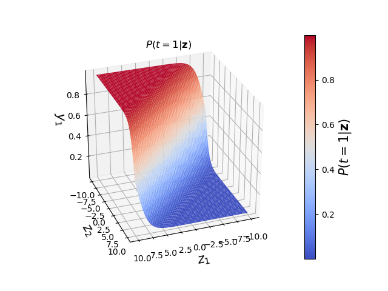

# 一个简单的神经网络的实现

不详述神经网络模型，只记录一下实现神经网络时的推导过程。

## 0. 数学复习

矩阵A(m, n)，m指行数，n指列数

## 1. 输入值和输出值

输入值是一个维度是n的特征向量，记作 $x=(x_1,x_2,\ldots,x_n)$。一个数据集里一般有多个样本，假定有m个样本，则将这数据集记作 $X = (x^{(1)},x^{(2)},\ldots,x^{(m)})$ 。

输出值一般是一个数值，用于表示属于哪个类别。对于m个样本，输出值的集合记作 $y=(y^{(1)}, y^{(2)}, \ldots, y^{(m)})$ 。

输入层的节点个数取决于输入的特征向量的维度。

输出层的节点个数取决于拥有的类别个数。如果只有2类，则可以只用一个输出节点用于预测0或1。

隐藏层的节点越多，则越复杂的函数可以fit到。但是这样做的代价也比较大，首先，会增大训练参数和进行预测的计算量。其次，大量的参数也容易导致过拟合。  需要根据具体情况选择节点的个数。

## 2. 正向传播

神经网络使用正向传播进行预测。

这里约定上标 (i) 为样本在样本集中的序号，上标 [i] 为神经网络的序号，下标 [i] 为某一隐藏层的节点的序号。

对于一个3层的神经网络，可以这样计算预测值 $\hat y$ ：
$$
\begin{align}
& z^{[1]} = W^{[1]}x+ b^{[1]} \\
& a^{[1]} = \sigma (z^{[1]}) \\
& z^{[2]} = W^{[2]}a^{[1]} + b^{[2]} \\
& a^{[2]} = \hat y = softmax (z^{[2]}) \\
\end{align}
$$
神经网络里的计算都需要进行向量化，具体来说

对于第1层的输入值和输出值
$$
X =   \begin{pmatrix}
        x_1^{(1)} & x_2^{(1)} & \cdots & x_n^{(1)} \\
        x_1^{(2)} & x_2^{(2)} & \cdots & x_n^{(2)} \\
        \vdots     & \vdots    & \ddots & \vdots \\
        x_1^{(m)} & x_2^{(m)} & \cdots & x_n^{(m)} \\
        \end{pmatrix} = \begin{pmatrix}
        x^{(1)} \\
        x^{(2)} \\
        \vdots \\
        x^{(m)} \\
        \end{pmatrix} , \qquad y = \begin{pmatrix}
        y^{(1)} \\
        y^{(2)} \\
        \vdots \\
        y^{(m)} \\
        \end{pmatrix}
$$
第2层

假设第2层有u个节点，则这层的权重和偏置为
$$
W^{[1]} = \begin{pmatrix}
        w_{1[1]} & w_{2[1]} & \cdots & w_{n[1]} \\
        w_{1[2]} & w_{2[2]} & \cdots & w_{n[2]} \\
        \vdots     & \vdots    & \ddots & \vdots \\
        w_{1[u]} & w_{2[u]} & \cdots & w_{n[u]} \\
        \end{pmatrix} = \begin{pmatrix}
        w_{[1]} \\ w_{[2]} \\ \vdots \\ w_{[u]} \\
        \end{pmatrix} , \qquad b^{[1]} = \begin{pmatrix}
        b_{[1]} \\
        b_{[2]} \\
        \vdots \\
        b_{[u]} \\
        \end{pmatrix}
$$
根据矩阵的分块的性质
$$
\begin{align}
W^{[1]}X^T &= \begin{pmatrix}
        w_{[1]} \\ w_{[2]} \\ \vdots \\ w_{[u]} \\
        \end{pmatrix} \begin{pmatrix}
        x^{(1)} & x^{(2)} & \ldots & x^{(m)} \\
        \end{pmatrix} = AB = \begin{pmatrix}
        A_{11} \\ A_{21} \\ \vdots \\ A_{u1} \\
        \end{pmatrix}  \begin{pmatrix}
        B_{11} & B_{12} & \ldots & B_{1m} \\
        \end{pmatrix} \\
       & = \begin{pmatrix}
        C_{11} & C_{12} & \cdots & C_{1m} \\
        C_{21} & C_{22} & \cdots & C_{2m} \\
        \vdots     & \vdots    & \ddots & \vdots \\
        C_{u1} & C_{u2} & \cdots & C_{um} \\
        \end{pmatrix} = \begin{pmatrix}
        A_{11}B_{11} & A_{11}B_{12} & \cdots & A_{11}B_{1m} \\
        A_{21}B_{11} & A_{21}B_{12} & \cdots & A_{21}B_{1m} \\
        \vdots     & \vdots    & \ddots & \vdots \\
        A_{u1}B_{11} & A_{u1}B_{12} & \cdots & A_{u1}B_{1m} \\
        \end{pmatrix}  \\
        & =  \begin{pmatrix}
        w_{[1]}x^{(1)} & w_{[1]}x^{(2)} & \cdots & w_{[1]}x^{(m)} \\
        w_{[2]}x^{(1)} & w_{[2]}x^{(2)} & \cdots & w_{[2]}x^{(m)} \\
        \vdots     & \vdots    & \ddots & \vdots \\
        w_{[u]}x^{(1)} & w_{[u]}x^{(2)} & \cdots & w_{[u]}x^{(m)} \\
        \end{pmatrix}
\end{align}
$$
参考numpy中的boardcast，则有
$$
\begin{align}
z^{[1]} &= W^{[1]}X^T + boardcast\ (b^{[1]}) =  \begin{pmatrix}
        w_{[1]}x^{(1)} + b_{[1]} & w_{[1]}x^{(2)} + b_{[1]} & \cdots & w_{[1]}x^{(m)} + b_{[1]} \\
        w_{[2]}x^{(1)} + b_{[2]} & w_{[2]}x^{(2)} + b_{[2]} & \cdots & w_{[2]}x^{(m)} + b_{[2]} \\
        \vdots     & \vdots    & \ddots & \vdots \\
        w_{[u]}x^{(1)} + b_{[u]} & w_{[u]}x^{(2)} + b_{[u]} & \cdots & w_{[u]}x^{(m)} + b_{[u]} \\
        \end{pmatrix} \\
        & =  \begin{pmatrix}
        z_{[1]}^{(1)} & z_{[1]}^{(2)} & \cdots & z_{[1]}^{(m)} \\
        z_{[2]}^{(1)} & z_{[2]}^{(2)} & \cdots & z_{[2]}^{(m)} \\
        \vdots     & \vdots    & \ddots & \vdots \\
        z_{[u]}^{(1)} & z_{[u]}^{(2)} & \cdots & z_{[u]}^{(m)} \\
        \end{pmatrix}
\end{align}
$$

$$
a^{[1]} =  \begin{pmatrix}
        \sigma(z_{[1]}^{(1)}) & \sigma(z_{[1]}^{(2)}) & \cdots & \sigma(z_{[1]}^{(m)}) \\
        \sigma(z_{[2]}^{(1)}) & \sigma(z_{[2]}^{(2)}) & \cdots & \sigma(z_{[2]}^{(m)}) \\
        \vdots     & \vdots    & \ddots & \vdots \\
        \sigma(z_{[u]}^{(1)}) & \sigma(z_{[u]}^{(2)}) & \cdots & \sigma(z_{[u]}^{(m)}) \\
        \end{pmatrix}
$$

以上的计算方式可以推广到多层神经网络中的任一隐藏层，对于第l层，将 $X$ 类比成 $a^{[l-1]}$ ， $W^{[1]}$ 类比成 $W^{[l]}$ ， $b^{[1]}$ 类比成 $b^{[l]}$ ， $z^{[1]}$ 类比成 $z^{[l]}$ ， $a^{[1]}$ 类比成 $a^{[l]}$ ，就可以了。

对于输出层，因为我们希望网络输出各个分类的概率，所以将输出层的激活函数选为[softmax](https://en.wikipedia.org/wiki/Softmax_function) 。softmax 是一种简便的将原始评分转换成概率的方法。可以将 softmax 看做 logistic 函数的在多分类下的推广。
$$
a^{[2]} =  softmax (z^{[1]}) = \begin{pmatrix}
        softmax(z^{(1)}) & softmax(z^{(2)}) & \ldots & softmax(z^{(m)}) \\
        \end{pmatrix}
$$


#### 权重和偏置的初始化

权重 w 不能全部置为0，这样会导致每个层的所有节点的计算都是相同的。如果激活函数使用sigmoid或者tanh，随机出来的 w 最好小一点，一般乘以0.01。因为如果 w 比较大，通过激活函数计算出来的值会落到接近1的位置，导致学习速度变慢。

偏置 b 可以全部初始化为0。

#### 激活函数

- [tanh](https://reference.wolfram.com/language/ref/Tanh.html)
- [sigmoid function](https://en.wikipedia.org/wiki/Sigmoid_function)
- [ReLUs](https://en.wikipedia.org/wiki/Rectifier_(neural_networks))

#### softmax ([wiki](https://en.wikipedia.org/wiki/Softmax_function))

softmax 又称为归一化指数函数，是广义上的 logistic 函数。假设k 维向量 $z$ 的各项是任意实数，使用 softmax 对 $z$ 进行“压缩”处理后，压缩后的向量 $\sigma (z)$ 的每一项的值在 [0, 1] 之间，所有项之和等于1。函数公式如下
$$
\sigma (z)_j = \frac {e^{z_j}}{ \sum_{k=1}^K e^{z_k} } \quad  for\ j = 1, \ldots, K.
$$

一个简单的例子如下

```python
import numpy as np
z = np.array([1.0, 2.0, 3.0, 4.0, 1.0, 2.0, 3.0])
exp_scores = np.exp(z)
probs = exp_scores / np.sum(exp_scores)  # 应用 softmax
print(z)
print(exp_scores)
print(probs)
print(np.sum(probs))
```

在神经网络的输出层中，有C个分类，对于给定的输入 $z$ ，每个分类的概率可以表示为：
$$
\begin{bmatrix}
    P(t=1|z) \\ P(t=2|z) \\ \vdots \\ P(t=C|z) \\
\end{bmatrix} = \frac {1}{ \sum_{k=1}^C e^{z_k} } \begin{bmatrix}
    e^{z_1} \\ e^{z_2} \\ \vdots \\ e^{z_C} \\
\end{bmatrix}
$$
其中，$P(t=c|z)$ 表示，在给定输入$z$时，该输入数据是$c$分类的概率。

在一个二分类$(t = 1, t = 2)$中，输入向量是$z = [z1, z2]$，那么输出概率$P(t=1|z)$如下所示：

```python
import numpy as np
from matplotlib import cm
import matplotlib.pyplot as plt
from mpl_toolkits.mplot3d import Axes3D

def softmax(z):
    exp_scores = np.exp(z)
    return exp_scores / np.sum(exp_scores)

#%matplotlib inline
# Plot the softmax output for 2 dimensions for both classes
# Plot the output in function of the weights
# Define a vector of weights for which we want to plot the output
nb_of_zs = 200
zs = np.linspace(-10, 10, num=nb_of_zs)  # input
zs_1, zs_2 = np.meshgrid(zs, zs)  # generate grid
y = np.zeros((nb_of_zs, nb_of_zs, 2))  # initialize output
# Fill the output matrix for each combination of input z's
for i in range(nb_of_zs):
    for j in range(nb_of_zs):
        y[i, j, :] = softmax(np.asarray([zs_1[i, j], zs_2[i, j]]))
# Plot the cost function surfaces for both classes
fig = plt.figure()
# Plot the cost function surface for t=1
ax = fig.gca(projection='3d')
surf = ax.plot_surface(zs_1, zs_2, y[:, :, 0], linewidth=0, cmap=cm.coolwarm)
ax.view_init(elev=30, azim=70)
cbar = fig.colorbar(surf)
ax.set_xlabel('$z_1$', fontsize=15)
ax.set_ylabel('$z_2$', fontsize=15)
ax.set_zlabel('$y_1$', fontsize=15)
ax.set_title('$P(t=1|\mathbf{z})$')
cbar.ax.set_ylabel('$P(t=1|\mathbf{z})$', fontsize=15)
plt.grid()
plt.show()

```




#### 例子 (TODO)

举一个直观的例子

由于手算比较耗时，这里使用mathematica进行符号计算，在mathematica中输入以下代码

```
{u, n, m} = {3, 2, 5}
Array[Subscript[w, ##] &, {u, n}] . Array[Subscript[x, ##] &, {n, m}]
```

得到结果
$$
\left(
\begin{array}{ccccc}
 w_{1,1} x_{1,1}+w_{1,2} x_{2,1} & w_{1,1} x_{1,2}+w_{1,2} x_{2,2} & w_{1,1} x_{1,3}+w_{1,2} x_{2,3} & w_{1,1} x_{1,4}+w_{1,2} x_{2,4} & w_{1,1} x_{1,5}+w_{1,2} x_{2,5} \\
 w_{2,1} x_{1,1}+w_{2,2} x_{2,1} & w_{2,1} x_{1,2}+w_{2,2} x_{2,2} & w_{2,1} x_{1,3}+w_{2,2} x_{2,3} & w_{2,1} x_{1,4}+w_{2,2} x_{2,4} & w_{2,1} x_{1,5}+w_{2,2} x_{2,5} \\
 w_{3,1} x_{1,1}+w_{3,2} x_{2,1} & w_{3,1} x_{1,2}+w_{3,2} x_{2,2} & w_{3,1} x_{1,3}+w_{3,2} x_{2,3} & w_{3,1} x_{1,4}+w_{3,2} x_{2,4} & w_{3,1} x_{1,5}+w_{3,2} x_{2,5} \\
\end{array}
\right)
$$

## 3. 反向传播

反向传播是目前用来训练人工神经网络的最常用且最有效的算法。其主要思想是：
（1）将训练集数据输入到输入层，经过隐藏层，最后达到输出层并输出结果，这是前向传播过程；
（2）由于输出层的输出结果与实际结果有误差，则计算估计值与实际值之间的误差，并将该误差从输出层向隐藏层反向传播，直至传播到输入层；
（3）在反向传播的过程中，根据误差调整各种参数的值；不断迭代上述过程，直至收敛。

我们把定义估计值与实际值之间误差的函数叫作误差损失(loss)函数。


向量化的过程是这样的

#### 交叉熵代价函数 [cross-entropy loss](https://en.wikipedia.org/wiki/Cross_entropy#Cross-entropy_error_function_and_logistic_regression)

3、终止条件
偏重的更新低于某个阈值；
预测的错误率低于某个阈值；
达到预设一定的循环次数；

## 4. 交叉验证

