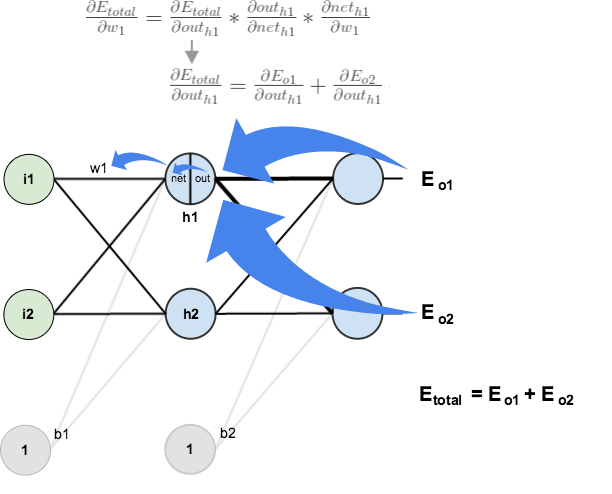

# 一个简单的BP神经网络的实现

不详述神经网络模型，只记录一下实现BP神经网络时的推导过程。

## 0. 数学复习

矩阵A(m, n)，m指行数，n指列数

sigmoid函数求导
$$
\begin{align}
\sigma^\prime(z) &= \bigl( \frac{1}{1 + e^{-z}} \bigr)^\prime = (-1)(1+e^{-z})^{(-1)-1} \cdot (e^{-z})^\prime = \frac{1}{(1+e^{-z})^2} \cdot  (e^{-z}) \\
&= \frac{1}{1+e^{-z}} \cdot \frac{e^{-z}}{1+e^{-z}} = \frac{1}{1+e^{-z}} \cdot (1-\frac{1}{1+e^{-z}}) \\
&= \sigma(z)(1-\sigma(z))
\end{align}
$$

## 1. 输入值和输出值

输入值是一个维度是n的特征向量，记作 $x=(x_1,x_2,\ldots,x_n)$。一个数据集里一般有多个样本，假定有m个样本，则将这数据集记作 $X = (x^{(1)},x^{(2)},\ldots,x^{(m)})$ 。

输出值一般是一个数值，用于表示属于哪个类别。对于m个样本，输出值的集合记作 $y=(y^{(1)}, y^{(2)}, \ldots, y^{(m)})$ 。

输入层的节点个数取决于输入的特征向量的维度。

输出层的节点个数取决于拥有的类别个数。如果只有2类，则可以只用一个输出节点用于预测0或1。

隐藏层的节点越多，则越复杂的函数可以fit到。但是这样做的代价也比较大，首先，会增大训练参数和进行预测的计算量。其次，大量的参数也容易导致过拟合。  需要根据具体情况选择节点的个数。

## 2. 正向传播

神经网络使用正向传播进行预测。

这里约定上标 (i) 为样本在样本集中的序号，上标 [i] 为神经网络的序号，下标 [i] 为某一隐藏层的节点的序号。

对于一个3层的神经网络，可以这样计算预测值 $\hat y$ ：
$$
\begin{align}
& z^{[1]} = W^{[1]}x+ b^{[1]} \\
& a^{[1]} = \sigma (z^{[1]}) \\
& z^{[2]} = W^{[2]}a^{[1]} + b^{[2]} \\
& a^{[2]} = \hat y = softmax (z^{[2]}) \\
\end{align}
$$
神经网络里的计算都需要进行向量化，具体来说

对于第1层的输入值和输出值
$$
X =   \begin{pmatrix}
        x_1^{(1)} & x_2^{(1)} & \cdots & x_n^{(1)} \\
        x_1^{(2)} & x_2^{(2)} & \cdots & x_n^{(2)} \\
        \vdots     & \vdots    & \ddots & \vdots \\
        x_1^{(m)} & x_2^{(m)} & \cdots & x_n^{(m)} \\
        \end{pmatrix} = \begin{pmatrix}
        x^{(1)} \\
        x^{(2)} \\
        \vdots \\
        x^{(m)} \\
        \end{pmatrix} , \qquad y = \begin{pmatrix}
        y^{(1)} \\
        y^{(2)} \\
        \vdots \\
        y^{(m)} \\
        \end{pmatrix}
$$
第2层

假设第2层有u个节点，则这层的权重和偏置为
$$
W^{[1]} = \begin{pmatrix}
        w_{1[1]} & w_{2[1]} & \cdots & w_{n[1]} \\
        w_{1[2]} & w_{2[2]} & \cdots & w_{n[2]} \\
        \vdots     & \vdots    & \ddots & \vdots \\
        w_{1[u]} & w_{2[u]} & \cdots & w_{n[u]} \\
        \end{pmatrix} = \begin{pmatrix}
        w_{[1]} \\ w_{[2]} \\ \vdots \\ w_{[u]} \\
        \end{pmatrix} , \qquad b^{[1]} = \begin{pmatrix}
        b_{[1]} \\
        b_{[2]} \\
        \vdots \\
        b_{[u]} \\
        \end{pmatrix}
$$
根据矩阵的分块的性质
$$
\begin{align}
W^{[1]}X^T &= \begin{pmatrix}
        w_{[1]} \\ w_{[2]} \\ \vdots \\ w_{[u]} \\
        \end{pmatrix} \begin{pmatrix}
        x^{(1)} & x^{(2)} & \ldots & x^{(m)} \\
        \end{pmatrix} = AB = \begin{pmatrix}
        A_{11} \\ A_{21} \\ \vdots \\ A_{u1} \\
        \end{pmatrix}  \begin{pmatrix}
        B_{11} & B_{12} & \ldots & B_{1m} \\
        \end{pmatrix} \\
       & = \begin{pmatrix}
        C_{11} & C_{12} & \cdots & C_{1m} \\
        C_{21} & C_{22} & \cdots & C_{2m} \\
        \vdots     & \vdots    & \ddots & \vdots \\
        C_{u1} & C_{u2} & \cdots & C_{um} \\
        \end{pmatrix} = \begin{pmatrix}
        A_{11}B_{11} & A_{11}B_{12} & \cdots & A_{11}B_{1m} \\
        A_{21}B_{11} & A_{21}B_{12} & \cdots & A_{21}B_{1m} \\
        \vdots     & \vdots    & \ddots & \vdots \\
        A_{u1}B_{11} & A_{u1}B_{12} & \cdots & A_{u1}B_{1m} \\
        \end{pmatrix}  \\
        & =  \begin{pmatrix}
        w_{[1]}x^{(1)} & w_{[1]}x^{(2)} & \cdots & w_{[1]}x^{(m)} \\
        w_{[2]}x^{(1)} & w_{[2]}x^{(2)} & \cdots & w_{[2]}x^{(m)} \\
        \vdots     & \vdots    & \ddots & \vdots \\
        w_{[u]}x^{(1)} & w_{[u]}x^{(2)} & \cdots & w_{[u]}x^{(m)} \\
        \end{pmatrix}
\end{align}
$$
参考numpy中的boardcast，则有
$$
\begin{align}
z^{[1]} &= W^{[1]}X^T + boardcast\ (b^{[1]}) =  \begin{pmatrix}
        w_{[1]}x^{(1)} + b_{[1]} & w_{[1]}x^{(2)} + b_{[1]} & \cdots & w_{[1]}x^{(m)} + b_{[1]} \\
        w_{[2]}x^{(1)} + b_{[2]} & w_{[2]}x^{(2)} + b_{[2]} & \cdots & w_{[2]}x^{(m)} + b_{[2]} \\
        \vdots     & \vdots    & \ddots & \vdots \\
        w_{[u]}x^{(1)} + b_{[u]} & w_{[u]}x^{(2)} + b_{[u]} & \cdots & w_{[u]}x^{(m)} + b_{[u]} \\
        \end{pmatrix} \\
        & =  \begin{pmatrix}
        z_{[1]}^{(1)} & z_{[1]}^{(2)} & \cdots & z_{[1]}^{(m)} \\
        z_{[2]}^{(1)} & z_{[2]}^{(2)} & \cdots & z_{[2]}^{(m)} \\
        \vdots     & \vdots    & \ddots & \vdots \\
        z_{[u]}^{(1)} & z_{[u]}^{(2)} & \cdots & z_{[u]}^{(m)} \\
        \end{pmatrix}
\end{align}
$$

$$
a^{[1]} =  \begin{pmatrix}
        \sigma(z_{[1]}^{(1)}) & \sigma(z_{[1]}^{(2)}) & \cdots & \sigma(z_{[1]}^{(m)}) \\
        \sigma(z_{[2]}^{(1)}) & \sigma(z_{[2]}^{(2)}) & \cdots & \sigma(z_{[2]}^{(m)}) \\
        \vdots     & \vdots    & \ddots & \vdots \\
        \sigma(z_{[u]}^{(1)}) & \sigma(z_{[u]}^{(2)}) & \cdots & \sigma(z_{[u]}^{(m)}) \\
        \end{pmatrix}
$$

以上的计算方式可以推广到多层神经网络中的任一隐藏层，对于第l层，将 $X$ 类比成 $a^{[l-1]}$ ， $W^{[1]}$ 类比成 $W^{[l]}$ ， $b^{[1]}$ 类比成 $b^{[l]}$ ， $z^{[1]}$ 类比成 $z^{[l]}$ ， $a^{[1]}$ 类比成 $a^{[l]}$ ，就可以了。

对于输出层，因为我们希望网络输出各个分类的概率，所以将输出层的激活函数选为[softmax](https://en.wikipedia.org/wiki/Softmax_function) 。softmax 是一种简便的将原始评分转换成概率的方法。可以将 softmax 看做 logistic 函数的在多分类下的推广。
$$
a^{[2]} =  softmax (z^{[1]}) = \begin{pmatrix}
        softmax(z^{(1)}) & softmax(z^{(2)}) & \ldots & softmax(z^{(m)}) \\
        \end{pmatrix}
$$


### 权重和偏置的初始化

权重 w 不能全部置为0，这样会导致每个层的所有节点的计算都是相同的。如果激活函数使用sigmoid或者tanh，随机出来的 w 最好小一点，一般乘以0.01。因为如果 w 比较大，通过激活函数计算出来的值会落到接近1的位置，导致学习速度变慢。

偏置 b 可以全部初始化为0。

### 激活函数

- [tanh](https://reference.wolfram.com/language/ref/Tanh.html)
- [sigmoid function](https://en.wikipedia.org/wiki/Sigmoid_function)
- [ReLUs](https://en.wikipedia.org/wiki/Rectifier_(neural_networks))

### softmax ([wiki](https://en.wikipedia.org/wiki/Softmax_function))

softmax 又称为归一化指数函数，是广义上的 logistic 函数。假设k 维向量 $z$ 的各项是任意实数，使用 softmax 对 $z$ 进行“压缩”处理后，压缩后的向量 $\sigma (z)$ 的每一项的值在 [0, 1] 之间，所有项之和等于1。函数公式如下
$$
\sigma (z)_j = \frac {e^{z_j}}{ \sum_{k=1}^K e^{z_k} } \quad  for\ j = 1, \ldots, K.
$$

一个简单的例子如下

```python
import numpy as np
z = np.array([1.0, 2.0, 3.0, 4.0, 1.0, 2.0, 3.0])
exp_scores = np.exp(z)
probs = exp_scores / np.sum(exp_scores)  # 应用 softmax
```

在神经网络的输出层中，有C个分类，对于给定的输入 $z$ ，每个分类的概率可以表示为：
$$
\begin{bmatrix}
    P(t=1|z) \\ P(t=2|z) \\ \vdots \\ P(t=C|z) \\
\end{bmatrix} = \frac {1}{ \sum_{k=1}^C e^{z_k} } \begin{bmatrix}
    e^{z_1} \\ e^{z_2} \\ \vdots \\ e^{z_C} \\
\end{bmatrix}
$$
其中，$P(t=c|z)$ 表示，在给定输入$z$时，该输入数据是$c$分类的概率。

对于 softmax 函数
$$
a_j = \frac {e^{z_j}}{ \sum_{k=1}^K e^{z_k} } \quad  for\ j = 1, \ldots, K.
$$
softmax 函数的求导过程比较特别，分如下2种情况。这是因为i = j 时，$z_i$ 与 $z_j$ 是同一个变量，按偏导数的定义，将多元函数关于一个自变量求偏导数时，就将其余的自变量看成常数，因此需要分2种情况处理。
$$
\begin{align}
&if \ j=i \\
&\qquad \frac{ \partial a_j }{ \partial z_i } = \frac{ \partial }{ \partial z_i } \Bigl( \frac {e^{z_j}}{ \sum_{k=1}^K e^{z_k} } \Bigr)
= \frac { (e^{z_j})^\prime \cdot \sum_k e^{z_k} - e^{z_j} \cdot e^{z_j} } { \Bigl( \sum_k e^{z_k} \Bigr)^2 }
= \frac { e^{z_j} } { \sum_k e^{z_k} } - \frac { e^{z_j} } { \sum_k e^{z_k} } \cdot \frac { e^{z_j} } { \sum_k e^{z_k} }
= a_j ( 1-a_j )
\\
&if \ j \neq i \\
&\qquad \frac{ \partial a_j }{ \partial z_i } = \frac{ \partial }{ \partial z_i } \Bigl( \frac {e^{z_j}}{ \sum_{k=1}^K e^{z_k} } \Bigr)
= \frac { 0 \cdot \sum_k e^{z_k} - e^{z_j} \cdot e^{z_i} } { \Bigl( \sum_k e^{z_k} \Bigr)^2 }
= - \frac { e^{z_j} } { \sum_k e^{z_k} } \cdot \frac { e^{z_i} } { \sum_k e^{z_k} }
= -a_j a_i
\end{align}
$$


### 例子 (TODO)

举一个直观的例子

由于手算比较费时，这里使用mathematica进行符号计算，在mathematica中输入以下代码

```
{u, n, m} = {3, 2, 5}
Array[Subscript[w, ##] &, {u, n}] . Array[Subscript[x, ##] &, {n, m}]
```

得到结果
$$
\left(
\begin{array}{ccccc}
 w_{1,1} x_{1,1}+w_{1,2} x_{2,1} & w_{1,1} x_{1,2}+w_{1,2} x_{2,2} & w_{1,1} x_{1,3}+w_{1,2} x_{2,3} & w_{1,1} x_{1,4}+w_{1,2} x_{2,4} & w_{1,1} x_{1,5}+w_{1,2} x_{2,5} \\
 w_{2,1} x_{1,1}+w_{2,2} x_{2,1} & w_{2,1} x_{1,2}+w_{2,2} x_{2,2} & w_{2,1} x_{1,3}+w_{2,2} x_{2,3} & w_{2,1} x_{1,4}+w_{2,2} x_{2,4} & w_{2,1} x_{1,5}+w_{2,2} x_{2,5} \\
 w_{3,1} x_{1,1}+w_{3,2} x_{2,1} & w_{3,1} x_{1,2}+w_{3,2} x_{2,2} & w_{3,1} x_{1,3}+w_{3,2} x_{2,3} & w_{3,1} x_{1,4}+w_{3,2} x_{2,4} & w_{3,1} x_{1,5}+w_{3,2} x_{2,5} \\
\end{array}
\right)
$$

## 3. 反向传播

反向传播是目前用来训练人工神经网络的最常用且最有效的算法。其主要思想是：
（1）将训练集数据输入到输入层，经过隐藏层，最后达到输出层并输出结果，这是前向传播过程；
（2）由于输出层的输出结果与实际结果有误差，则计算估计值与实际值之间的误差，并将该误差从输出层向隐藏层反向传播，直至传播到输入层；
（3）在反向传播的过程中，根据误差调整各种参数的值；不断迭代上述过程，直至收敛。

### 代价函数

我们把定义估计值与实际值之间误差(单个样本)的函数叫作误差损失(loss)函数，代价(cost)函数是各个样本的loss函数的平均。

如果误差损失函数采用二次代价函数 ，在实际中，如果误差越大，参数调整的幅度可能更小，训练更缓慢。使用交叉熵代价函数替换二次代价函数，可以解决学习缓慢的问题。

> 示性函数：$1\{\cdot\}$
> 取值规则为：$1\{值为真的表达式\}=1$ ，$1\{值为假的表达式\}=0$ 。举例来说，表达式 $1\{2+2=4\}$的值为1，$1\{1+1=5\}$的值为 0。

在分类问题中，交叉熵代价函数与对数似然代价函数在形式上是基本一致的。

对于输出层的softmax激活函数，

假设有m个样本，k个类别，将$p(x)$记为$1\{ y^{(i)} = j \}$，$q(x)$记为softmax函数的输出值

则根据交叉熵公式，
$$
H(p,q) = - \sum_x p(x)log\ q(x)
$$
可以得到交叉熵代价函数为：
$$
J(\theta) = -\frac{1}{m} \Biggl[ \sum_{i=1}^m  \biggl[ \sum_{j=1}^k 1\{ y^{(i)} = j \} \ log \frac{e^{\theta_j^T x^{(i)}}}{ \sum_{l=1}^k e^{ \theta_l^T x^{(i)} } }  \biggl] \Biggl]
$$
从似然函数的角度分析，记$h_{\theta j}(x)= \frac{e^{\theta_j^T x}}{ \sum_{l=1}^k e^{ \theta_l^T x } }$  (h一般是hypothesis的缩写)，在一个样本中，对于输入x的分类结果为j的概率为
$$
P(y=j|x; \theta) = h_{\theta j} (x)^{ 1\{ y = j \}  }
$$
将所有分类的概率综合起来，则有：
$$
P(y|x; \theta) = \prod_{j=1}^k h_{\theta j} (x)^{ 1\{ y = j \}  }
$$
取似然函数为：
$$
\begin{align}
L(\theta) &= \prod_{i=1}^m P(y^{(i)} | x^{(i)}; \theta) \\
&= \prod_{i=1}^m \biggl[ \prod_{j=1}^k h_{\theta j} (x^{(i)})^{1\{ y^{(i)} = j \}} \biggl]
\end{align}
$$
对数似然函数为：
$$
\begin{align}
l(\theta) &= log\ L(\theta) \\
&= \sum_{i=1}^m \biggl[ \sum_{j=1}^k 1\{ y^{(i)} = j \} \ log\ h_{\theta j} (x^{(i)})  \biggl]
\end{align}
$$

最大似然估计就是要求得使$l(\theta)$取最大值时的$\theta$ 。一般将它乘上一个负系数**-1/m**，即：
$$
J(\theta) = - \frac{1}{m} l(\theta)
$$
则$J(\theta)$取最小值时的$\theta$为要求的最佳参数。这也就是上面的交叉熵代价函数。


> 1. log MN = log M + log N
> 2. 很多文献里对数都没标底数，这说明可以取任意底数，一般取2或e，取不同的底数时，对数值只相差了一个常数系数，对算法不会有影响。

相关的具体分析参考如下链接：
- [Softmax回归](http://deeplearning.stanford.edu/wiki/index.php/Softmax%E5%9B%9E%E5%BD%92)
- [Softmax Regression](http://ufldl.stanford.edu/tutorial/supervised/SoftmaxRegression/)
- [Softmax分类函数](http://www.jianshu.com/p/8eb17fa41164)
- [neural_network_implementation_intermezzo02](https://github.com/peterroelants/peterroelants.github.io/blob/master/notebooks/neural_net_implementation/neural_network_implementation_intermezzo02.ipynb)
- [Improving the way neural networks learn](http://neuralnetworksanddeeplearning.com/chap3.html)
- [交叉熵代价函数](http://blog.csdn.net/u014313009/article/details/51043064)


### 交叉熵代价函数 [cross-entropy loss](https://en.wikipedia.org/wiki/Cross_entropy#Cross-entropy_error_function_and_logistic_regression)

#### 二次代价函数的不足

考察一下二次代价函数
$$
C = \frac {1}{2n} \sum_x \| y(x) - a^L(x) \|^2
$$
其中，C表示代价，x表示样本，y表示实际值，a表示输出值，n表示样本的总数。为简单起见，同样一个样本为例进行说明，此时二次代价函数为：
$$
C = \frac {(y-a)^2}{2}
$$
在用梯度下降法(gradient descent) 调整权重w和偏置b的过程中，w和b的梯度推导如下：
$$
\begin{align}
&\frac { \partial C }{ \partial w } = (a - y)\sigma^\prime(z) x \\
&\frac { \partial C }{ \partial b } = (a - y)\sigma^\prime(z) \\
\end{align}
$$
可以看出，w和b的梯度跟激活函数的梯度成正比，激活函数的梯度越大，w和b的大小调整得越快，训练收敛得就越快。而神经网络常用的激活函数为sigmoid函数或tanh函数，观察这些激活函数的图像，当初始的代价（误差）越大时，梯度（导数）越小，训练的速度越慢。这与我们的期望不符，即：不能像人一样，错误越大，改正的幅度越大，从而学习得越快。

#### 交叉熵代价函数

为了克服二次代价函数学习缓慢的缺点，引入了交叉熵代价函数：
$$
C = - \frac{1}{n} \sum_x [yln\ a + (1-y)ln(1-a)]
$$

其中，x表示样本，n表示样本的总数。重新计算参数w的梯度：
$$
\begin{align}
\frac{\partial C}{\partial w_j} &= -\frac{1}{n} \sum_x \Bigl( \frac{y}{\sigma(z)} -\frac{(1-y)}{1-\sigma(z)} \Bigr) \frac{\partial \sigma}{\partial w_j} \\
&= -\frac{1}{n} \sum_x \Bigl( \frac{y}{\sigma(z)} -\frac{(1-y)}{1-\sigma(z)} \Bigr) \sigma^\prime(z)x_j \\
&= \frac{1}{n} \sum_x  \frac{ \sigma^\prime(z)x_j }{\sigma(z) (1-\sigma(z))} (\sigma(z)-y) \\
&= \frac{1}{n} \sum_x  x_j (\sigma(z)-y) \\
\end{align}
$$
其中，w的梯度公式中原来的 $\sigma^\prime(z)$ 被消掉了；另外，该梯度公式中的 $\sigma(z)-y$ 表示输出值与实际值之间的误差。所以，当误差越大，梯度就越大，参数w调整得越快，训练速度也就越快。同理可得，b的梯度为：
$$
\frac{\partial C}{\partial b} = \frac{1}{n} \sum_x (\sigma(z)-y)
$$

#### 交叉熵代价函数的来源

用交叉熵代替二次代价函数的想法源自哪里？

以偏置b的梯度计算为例
$$
\begin{align}
\frac{\partial C}{\partial b} &= \frac{\partial C}{\partial a} \cdot \frac{\partial a}{\partial z} \cdot \frac{\partial z}{\partial b} \\
&= \frac{\partial C}{\partial a} \cdot \sigma^\prime(z) \cdot \frac{\partial (wx+b)}{\partial b} \\
&= \frac{\partial C}{\partial a} \cdot \sigma^\prime(z) \\
&= \frac{\partial C}{\partial a} \cdot a(1-a) \\
\end{align}
$$
而二次代价函数推导出来的b的梯度公式为：
$$
\frac { \partial C }{ \partial b } = (a - y)\sigma^\prime(z)
$$
为了消掉该公式中的 $\sigma^\prime(z)$ ，需要找到一个代价函数使得：
$$
\frac { \partial C }{ \partial b } = (a - y)
$$
即
$$
\frac { \partial C }{ \partial a } \cdot a(1-a) = (a - y)
$$
对方程进行关于a的积分，可得：
$$
C = -[yln\ a + (1-y)ln(1-a)] + constant
$$
其中constant是积分常量。这是一个单独训练样本X对代价函数的贡献。为了得到整个的代价函数，还需要对所有的训练样本进行平均，可得：
$$
C = -\frac{1}{n} \sum_x [yln\ a + (1-y)ln(1-a)] + constant
$$
而这就是前面的交叉熵代价函数。

在分类问题中，交叉熵其实就是对数似然函数的最大化。

关于交叉熵的更多内容，参考以下链接：
- [交叉熵（Cross-Entropy）](http://blog.csdn.net/rtygbwwwerr/article/details/50778098)
- [Cross entropy](https://en.wikipedia.org/wiki/Cross_entropy)
- [怎样理解 Cross Entropy](http://shuokay.com/2017/06/23/cross-entropy/)
- [信息论的熵](http://blog.csdn.net/hguisu/article/details/27305435)
- [Entropy](https://en.wikipedia.org/wiki/Entropy_(information_theory))

### 反向传播算法

> 求导的链式法则 ([Chain rule](https://en.wikipedia.org/wiki/Chain_rule)) ：
> 表达式：$(f(g(x)))^\prime = f^\prime (g(x)) g^\prime (x)$
> 其他形式：$\frac {dy}{dx} = \frac {dy}{dz} \cdot \frac {dz}{dx}$

求$J(W, b)$的最小值可以使用梯度下降法，根据梯度下降法可得$W$和$b$的更新过程：
$$
W^{[l]}_{[i]j} := W^{[l]}_{[i]j} - \alpha \frac{\partial}{\partial \ W^{[l]}_{[i]j}} J(W, b) \\
b^{[l]}_{[i]} := b^{[l]}_{[i]} - \alpha \frac{\partial}{\partial \ b^{[l]}_{[i]}} J(W, b)
$$
其中，$\alpha$为学习步长，$W^{[l]}_{[i]j}$为第l层的第i个节点的权重第j个分量，$b^{[l]}_{[i]}$为第l层的第i个节点的偏置。

#### 输出层

输出层的激活函数采用的是softmax函数。根据前文，输出层的误差采用交叉熵代价函数来衡量，即：
$$
z_{[i]} = W_{[i]} x + b_{[i]}  \\
a_{[i]} = h_{W_{[i]}, b_{[i]}}(z_{[i]}) = \frac{e^{z_{[i]}}}{ \sum_{k=1}^K e^{ z_k } }   \\
J(W, b) = -\frac{1}{m} \Biggl[ \sum_{i=1}^m  \biggl[ \sum_{j=1}^k 1\{ y^{(i)} = j \} \ log \ a_{[j]}  \biggl] \Biggl]
$$
其中，依照前文约定，下标 [i] 为第$i$个节点的序号，上标 (i) 为样本在样本集中的序号。

输出层的第$l$个节点的权重$W_{[l]}$的第$t$个分量，求导(梯度)为：
$$
\begin{align}
\frac{\partial}{\partial \ W_{[l]t}} J(W, b) &= -\frac{1}{m} \Biggl[ \sum_{i=1}^m \biggl[ \frac{\partial}{\partial \ W_{[l]t}} \biggl[ \sum_{j=1}^k 1\{ y^{(i)} = j \} \ log\ a_{[j]}  \biggl] \biggl] \Biggl] \\
&= -\frac{1}{m} \Biggl[ \sum_{i=1}^m \biggl[ \frac{\partial}{\partial \ W_{[l]t}} \biggl( 1\{ y^{(l)} = l \} \ log\ a_{[l]}  \biggl) +  \frac{\partial}{\partial \ W_{[l]t}} \biggl( \sum_{j=1,j \neq l}^k 1\{ y^{(i)} = j \} \ log\ a_{[j]} \biggr) \biggl] \Biggl] \\
&= -\frac{1}{m} \Biggl[ \sum_{i=1}^m \biggl[ 1\{ y^{(l)} = l \} \biggl( \frac{\partial \ (log\ a_{[l]}) }{\partial \ a_{[l]}} \cdot \frac{\partial \ a_{[l]}}{\partial \ z_{[l]}} \cdot \frac{\partial \ z_{[l]}}{\partial \ W_{[l]t}}  \biggl) +  \biggl( \sum_{j=1,j \neq l}^k 1\{ y^{(i)} = j \} \cdot \frac{\partial \ (log\ a_{[j]}) }{\partial \ a_{[j]}} \cdot \frac{\partial \ a_{[j]}}{\partial \ z_{[l]}} \cdot \frac{\partial \ z_{[l]}}{\partial \ W_{[l]t}} \biggr)  \biggl] \Biggl] \\
&= -\frac{1}{m} \Biggl[ \sum_{i=1}^m \biggl[ 1\{ y^{(l)} = l \} \biggl( \frac{1}{a_{[l]}} \cdot a_{[l]} ( 1-a_{[l]} ) \biggl) +  \biggl( \sum_{j=1,j \neq l}^k 1\{ y^{(i)} = j \} \cdot \frac{1}{a_{[j]}} \cdot (-a_{[j]} a_{[l]}) \biggr)  \biggl] \cdot x^{(i)}_t \Biggl] \\
&= -\frac{1}{m} \Biggl[ \sum_{i=1}^m \biggl[ 1\{ y^{(l)} = l \} \cdot ( 1-a_{[l]} ) - \sum_{j=1,j \neq l}^k 1\{ y^{(i)} = j \} \cdot a_{[l]} \biggl] \cdot x^{(i)}_t \Biggl] \\
&= -\frac{1}{m} \Biggl[ \sum_{i=1}^m \biggl[ 1\{ y^{(l)} = l \} - 1\{ y^{(l)} = l \} \cdot a_{[l]} - \sum_{j=1,j \neq l}^k 1\{ y^{(i)} = j \} \cdot a_{[l]} \biggl] \cdot x^{(i)}_t \Biggl] \\
&= -\frac{1}{m} \Biggl[ \sum_{i=1}^m \biggl[ 1\{ y^{(l)} = l \} - a_{[l]} \cdot \sum_{j=1}^k 1\{ y^{(i)} = j \} \biggl] \cdot x^{(i)}_t \Biggl] \\
&= -\frac{1}{m} \Biggl[ \sum_{i=1}^m \biggl( 1\{ y^{(l)} = l \} - a_{[l]} \biggl) \cdot x^{(i)}_t \Biggl] \\
\end{align}
$$
输出层的第$l$个节点的偏置$b_{[l]}$的求导(梯度)为：
$$
\begin{align}
\frac{\partial}{\partial \ b_{[l]}} J(W, b) &= -\frac{1}{m} \Biggl[ \sum_{i=1}^m \biggl[ \frac{\partial}{\partial \ b_{[l]}} \biggl[ \sum_{j=1}^k 1\{ y^{(i)} = j \} \ log\ a_{[j]}  \biggl] \biggl] \Biggl] \\
&= -\frac{1}{m} \Biggl[ \sum_{i=1}^m \biggl[ \frac{\partial}{\partial \ b_{[l]}} \biggl( 1\{ y^{(l)} = l \} \ log\ a_{[l]}  \biggl) +  \frac{\partial}{\partial \ b_{[l]}} \biggl( \sum_{j=1,j \neq l}^k 1\{ y^{(i)} = j \} \ log\ a_{[j]} \biggr) \biggl] \Biggl] \\
&= -\frac{1}{m} \Biggl[ \sum_{i=1}^m \biggl[ 1\{ y^{(l)} = l \} \biggl( \frac{\partial \ (log\ a_{[l]}) }{\partial \ a_{[l]}} \cdot \frac{\partial \ a_{[l]}}{\partial \ z_{[l]}} \cdot \frac{\partial \ z_{[l]}}{\partial \ b_{[l]}}  \biggl) +  \biggl( \sum_{j=1,j \neq l}^k 1\{ y^{(i)} = j \} \cdot \frac{\partial \ (log\ a_{[j]}) }{\partial \ a_{[j]}} \cdot \frac{\partial \ a_{[j]}}{\partial \ z_{[l]}} \cdot \frac{\partial \ z_{[l]}}{\partial \ b_{[l]}} \biggr)  \biggl] \Biggl] \\
&= -\frac{1}{m} \Biggl[ \sum_{i=1}^m \biggl[ 1\{ y^{(l)} = l \} \biggl( \frac{1}{a_{[l]}} \cdot a_{[l]} ( 1-a_{[l]} ) \cdot 1 \biggl) +  \biggl( \sum_{j=1,j \neq l}^k 1\{ y^{(i)} = j \} \cdot \frac{1}{a_{[j]}} \cdot (-a_{[j]} a_{[l]}) \cdot 1 \biggr)  \biggl] \Biggl] \\
&= -\frac{1}{m} \Biggl[ \sum_{i=1}^m \biggl[ 1\{ y^{(l)} = l \} \cdot ( 1-a_{[l]} ) - \sum_{j=1,j \neq l}^k 1\{ y^{(i)} = j \} \cdot a_{[l]} \biggl] \Biggl] \\
&= -\frac{1}{m} \Biggl[ \sum_{i=1}^m \biggl[ 1\{ y^{(l)} = l \} - 1\{ y^{(l)} = l \} \cdot a_{[l]} - \sum_{j=1,j \neq l}^k 1\{ y^{(i)} = j \} \cdot a_{[l]} \biggl] \Biggl] \\
&= -\frac{1}{m} \Biggl[ \sum_{i=1}^m \biggl[ 1\{ y^{(l)} = l \} - a_{[l]} \cdot \sum_{j=1}^k 1\{ y^{(i)} = j \} \biggl] \Biggl] \\
&= -\frac{1}{m} \Biggl[ \sum_{i=1}^m \biggl[ 1\{ y^{(l)} = l \} - a_{[l]} \biggl] \Biggl] \\
&= a_{[l]} - 1\{ y^{(l)} = l \} \\
\end{align}
$$

在很多的文献中，会把上式记成如下形式：
$$
\begin{align}
\delta_{[l]} &= \frac{\partial \ loss(W, b) }{\partial \ z_{[l]}} =  \\
\frac{\partial}{\partial \ W_{[l]t}} J(W, b) &= \frac{\partial \ J(W, b) }{\partial \ z_{[l]}} \cdot \frac{\partial \ z_{[l]}}{\partial \ W_{[l]t}}   \\


\end{align}
$$


> 1. 这里log的底数用的是e
> 2. 这里的x指的是输出层的上一层的输出
> 3. 关于$\delta$的原文是：for each node $i$ in layer $l$, we would like to compute an “error term” $\delta^{(l)}$ that measures how much that node was “responsible” for any errors in our output ，链接在[这里](http://ufldl.stanford.edu/tutorial/supervised/MultiLayerNeuralNetworks/)

#### 隐藏层

隐藏层的激活函数采用的是tanh函数。

先考虑只有一个隐藏层的情况，参考一下网上的这张图片，可以发现当前层的每个节点的权重和偏置会影响下一层的各个节点


$$
\begin{align}
\frac{\partial}{\partial \ W^{[1]}_{[l]t}} J(W, b) &= \frac{\partial \ J(W, b)}{\partial \ a^{[1]}_{[l]}} \cdot \frac{\partial \ a^{[1]}_{[l]}}{\partial \ z^{[1]}_{[l]}} \cdot \frac{\partial \ z^{[1]}_{[l]}}{\partial \ W^{[1]}_{[l]t}} 
\end{align}
$$


向量化的过程是这样的


参考

https://www.zhihu.com/question/24827633/answer/91489990

https://mattmazur.com/2015/03/17/a-step-by-step-backpropagation-example/

#### 终止条件

- 偏重的更新低于某个阈值；
- 预测的错误率低于某个阈值；
- 达到预设一定的循环次数；

## 4. 交叉验证

如何计算准确率？最简单的方法是通过一组训练集和测试集，训练集通过训练得到模型，将测试集输入模型得到测试结果，将测试结果和测试集的真实标签进行比较，得到准确率。
在机器学习领域一个常用的方法是交叉验证方法。一组数据不分成2份，可能分为10份，
第1次：第1份作为测试集，剩余9份作为训练集；
第2次：第2份作为测试集，剩余9份作为训练集；
......
这样经过10次训练，得到10组准确率，将这10组数据求平均值得到平均准确率的结果。这里10是特例。一般意义上将数据分为k份，称该算法为K-fold cross validation，即每一次选择k份中的一份作为测试集，剩余k-1份作为训练集，重复k次，最终得到平均准确率，是一种比较科学准确的方法。


